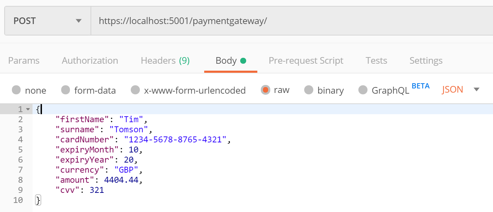
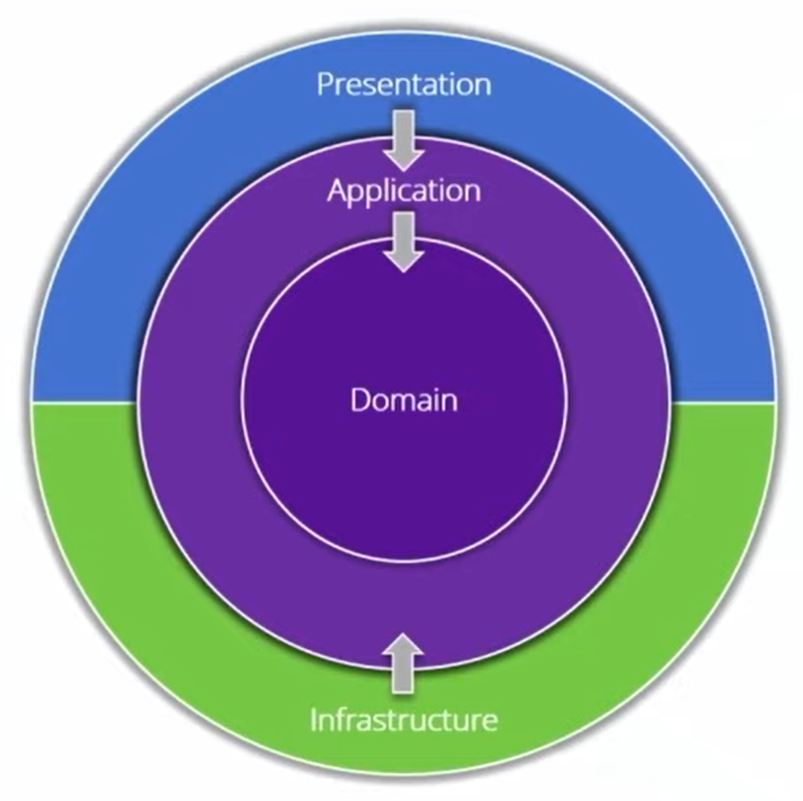

# Payment Gateway demo


## Steps to run the API using Docker Compose

This will build and run the Payment Gateway API in a Docker container, as well as Prometheus and Grafana containers.

Clone this repository, then from the root directory of the solution, run the following based on your environment:

### Mac

```
docker-compose -f docker-compose.yml -f docker-compose-mac.yml up
```

### Windows

```
docker-compose -f docker-compose.yml -f docker-compose-windows.yml up
```

### URLs when running via Docker Compose
- Payment Gateway API via Swagger: http://localhost:8080/swagger
- Prometheus: http://localhost:9090/graph
- Grafana: http://localhost:3000/


## Steps to get Payment Gateway running locally using `dotnet run`

Firstly, clone this repository and then:

### To run the API locally

From the root directory of the project, enter the following:

```bash
dotnet run --project src/API/API.csproj
```

### To run the tests

From the root directory of the solution, enter the following:

```bash
dotnet test
```


## Using the API

### Making a payment

You can interact with the API using a tool such as [Postman](https://www.postman.com/) or access it using [Swagger](https://swagger.io/) on the following URL whilst the application is running locally: https://localhost:5001/swagger

With the API running locally, send a Post request to the following URL

```text
https://localhost:5001/api/v1/payments
```

with the body of the payload formatted like this:

```JSON
{
    "firstName": "Tim",
    "surname": "Tomson",
    "cardNumber": "1234-5678-8765-4321",
    "expiryMonth": 10,
    "expiryYear": 20,
    "currency": "GBP",
    "amount": 4404.44,
    "cvv": 321
}
```

<p align="center">
  
</p>

Upon success, you will receive an `id` like the following.

```JSON
{
    "id": "9e51d18a-e022-4aed-8d62-01a2cc0bea7d"
}
```

You can use this id to retrieve information about the request from the `get` endpoint.

#### N.B. Dummy Acquiring Bank validation

To simulate success and error cases from the acquiring bank, some dummy validation rules have been applied.

The payment will only succeed if:

- the amount is greater than 0,
- the amount is less than 10,000,
- the currency is GBP, EUR or USD (and it will fail for JPY and AUD).

### Retrieving information about the payment

Use Postman, and make an `HttpGet` request with the `id` (obtained above) appended to the URL.

e.g. the Payment demonstrated above returned an id of `9e51d18a-e022-4aed-8d62-01a2cc0bea7d`

So to get information about this payment, send a Get request to:

```text
https://localhost:5001/api/v1/payments/9e51d18a-e022-4aed-8d62-01a2cc0bea7d
```

<p align="center">
  
</p>

## Architecture and design decisions

### CQRS

I used a CQRS pattern to separate out my queries and commands to enable a clean separation of concerns, testability and loose coupling.

### Onion architecture

I used an onion architecture pattern to organise the project, inspired by [Clean Architecture with ASP.NET Core 3.0 - Jason Taylor](https://www.youtube.com/watch?v=5OtUm1BLmG0)

This enables all of the dependencies to point inwards and creates very loose coupling between the layers.

<p align="center">
  
</p>

- Where the diagram shows `Presentation`, that is where the `API` lives in my project.
- Business logic should live in the `Application` and `Domain` layers.

  Large scale applications divide the business logic between these two layers by differentiating between application specific logic, and shared enterprise-wise domain logic.

  Because of the small scale of my sample application, I thought it would be over engineering to include both of these in my project, hence I have only included an `Application` layer.

- `Infrastructure` is where all external dependencies live, hence the wrapper for the Acquiring Bank Http Client lives here, as well as the persistence logic to save the payments to the database.

### Validation

I decided to use `Fluent Validation` to enforce the validation of the data being posted to the API. I chose to plug it into the built in AspNetCore validation as this provides a simple way of returning messages to the consumer of the API.

With some more work it could be plugged into the MediatR behaviour pipeline and provide domain model validation.

### Integration tests

I have written some integration tests that call the API to check data can be inserted and retrieved, as well as that the validation logic is being applied.

## Technologies and libraries

- [MediatR](https://github.com/jbogard/MediatR)

  I chose to use MediatR because it permits high decoupling between layers of the codebase, and very thin API Controllers.

- [Automapper](https://github.com/AutoMapper/AutoMapper)

  Automapper simplifies the mapping from DTOs, commands, queries and domain models and removes a lot of boilerplate code.

- [LiteDB](https://www.litedb.org/)

  I chose to use LiteDB to persist the payment details as it is very lightweight, has a simple API and did all that I required.

- [CSharpFunctionalExtensions](https://www.nuget.org/packages/CSharpFunctionalExtensions/)

  I used this library mainly for the `Result<T>` class that provides a straightforward and consistent way of getting success and failure statuses from methods

- [XUnit](https://xunit.net/)

  I needed a modern testing library so I chose XUnit because it works really well with .NET Core.

- [Fluent Validation](https://fluentvalidation.net/)

  I decided to use Fluent Validation because it has a simple and expressive API for writing schema validation rules.

- [Swagger](https://swagger.io/)

  I have added Swagger for documenting the API and to assist with discovery and exploration. 
  
- [Prometheus](https://prometheus.io/)  

  Prometheus is an open source metrics server and has emerged as the most popular metrics server for containerized applications.
  
- [Grafana](https://grafana.com/)

  Grafana is the open source analytics and monitoring solution and works very nicely with Prometheus.
